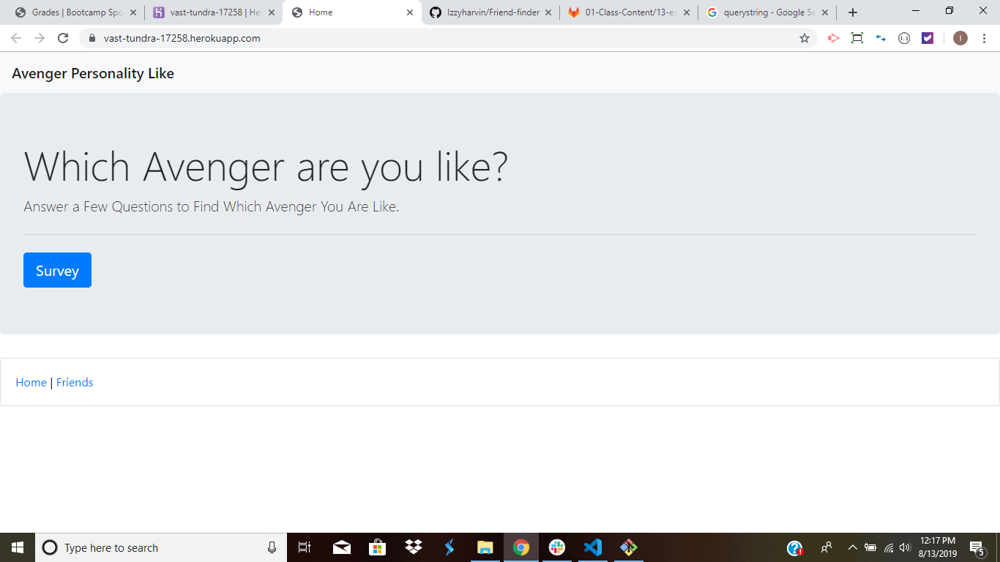

# Friend-finder

# Overview
I build a compatibility-based "FriendFinder" application. This full-stack site will take in results from your users' surveys, then compare their answers with those from other users. The app will then display the name and picture of the user with the best personality match.

# Link:
https://vast-tundra-17258.herokuapp.com/

# How to use Friend Finder
Step 1: You will be introduce the Friend Finder Home page. 
 
Step 2: You will click on survey that is on the home page and it will lead you to the survey page. 
 
Step 3: Once done taking the survey you press submit and it will show you your personality match. 

# Files used:
- ReadMe
- server.js
- gitignore
- package.json
- app
  - data
    - friends.js
  - public
    - home.html
    - survey.html
  - routing
    - apiRoutes.js
    - htmlRoutes.js

# Creator of App
Israel Harvin 8/13/2019